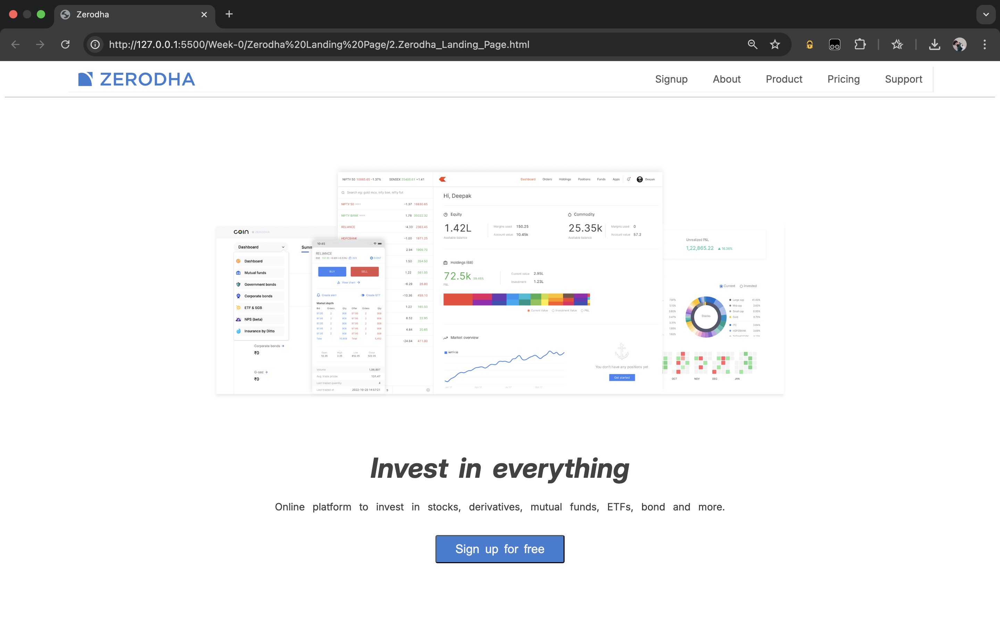

# Zerodha Landing Page (Partial Clone)

 <!-- Replace with your image file name -->

A **partial clone** of the Zerodha landing page built using **HTML and CSS**. This project replicates the layout and basic design of the original homepage for learning and practice purposes.

---

## 🚀 Features

- Responsive Flexbox layout
- Navigation bar with logo and menu
- Landing section with image and headline
- Google Fonts integration
- Clean and semantic HTML5 structure
- Simple CSS styling without frameworks

---

## 🛠️ Tech Stack

- **HTML5**
- **CSS3**
- **Google Fonts**
- (No JavaScript yet – purely static)

---

## 📷 Preview

>   
> *This is a static UI clone for learning HTML and CSS.*

---

## 📁 Folder Structure

