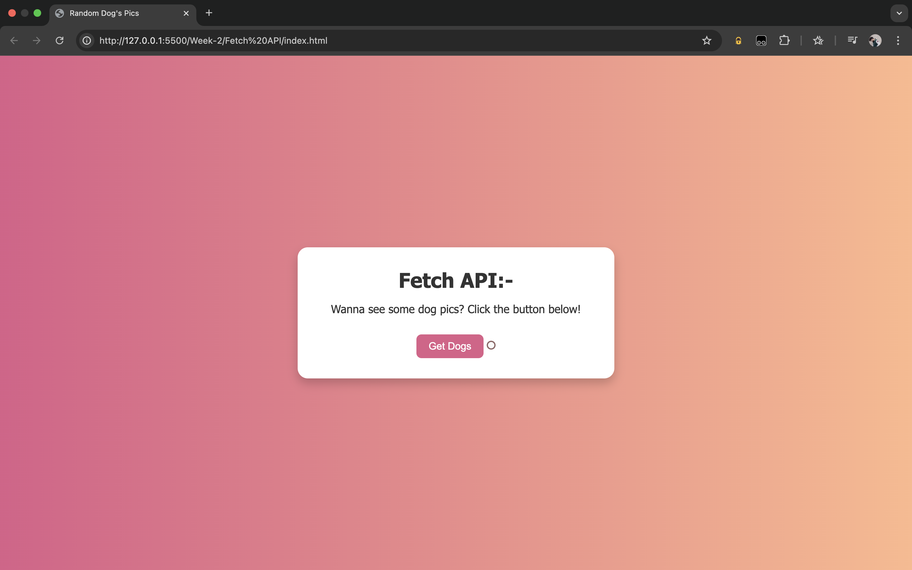

# 🐶 Random Dog Image Fetcher

## 📸 Screenshot

  
**Before Fetching**
  

  
**After Fetching**
  

A fun and beginner-friendly web app that uses the **Fetch API** to display random dog images from the [Dog CEO API](https://dog.ceo/dog-api/). Click the button and enjoy a new dog picture every time!

---

## 🚀 Features

- 🐕 Fetches random dog images using Fetch API
- 🎨 Stylish, centered, and responsive layout
- 💡 Simple, beginner-friendly code
- 🧩 Uses HTML, CSS, and JavaScript (no frameworks)

---

## 🌐 Technologies Used

- HTML5
- CSS3 (Flexbox + Gradients)
- JavaScript (ES6+)
- [Dog CEO API](https://dog.ceo/dog-api/)

---

